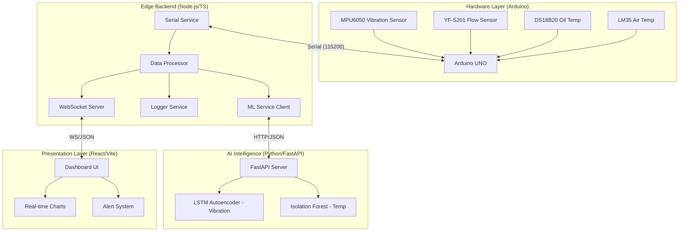

# Guardian Watch: Transformer Health Monitoring System - Technical Documentation

## 1. Executive Summary
Guardian Watch is an end-to-end IoT and AI solution designed for real-time monitoring and predictive maintenance of power transformers. The system captures critical physical parameters—vibration, oil flow, oil temperature, and ambient temperature—to detect early signs of mechanical wear, cooling system failure, or electrical anomalies. By combining rule-based heuristics with advanced Machine Learning (ML) models, it provides a comprehensive "Health Index" that allows operators to transition from reactive to proactive maintenance.

---

## 2. System Architecture

The system is composed of four distinct layers working in harmony:



---

## 3. Detailed File-by-File Breakdown

### 📂 `/arduino`
*   **`transformer_monitor.ino`**: 
    *   **Logic**: Uses a non-blocking sampling technique for vibration (calculating RMS over 100 samples) and an interrupt-driven approach for flow rate to ensure high accuracy without stalling the loop.
    *   **Output**: Sends a multi-line "SENSOR SUMMARY" every 500ms.

### 📂 `/backend/src`
*   **`index.ts`**: The orchestration hub. It bootstraps the Express server (port 3001) and initiates the Serial connection.
*   **`services/serial.service.ts`**: 
    *   **Parsing**: Uses Regular Expressions to extract values from the Arduino's text stream.
    *   **Simulation**: Includes a sophisticated simulator that generates realistic sensor drift and periodic "Anomaly Events" for testing when hardware is disconnected.
*   **`services/ml.service.ts`**: 
    *   **Windowing**: Buffers the last 50 vibration readings and 5 temperature readings.
    *   **Feature Engineering**: Calculates rolling means, standard deviations, and rates of change (acceleration) before sending data to the Python service.
*   **`services/dataProcessor.ts`**: 
    *   **Health Index Algorithm**: Calculates a weighted score. If a sensor exceeds a "Hard Threshold", health drops significantly. If the AI detects an "Anomaly", health drops moderately.
*   **`services/logger.service.ts`**: 
    *   **Persistence**: Appends data to `logs/data.csv`. This CSV is formatted specifically to be re-imported into the training pipeline for model improvement.

### 📂 `/python`
*   **`app.py`**:
    *   **Vibration Model**: An LSTM Autoencoder. It attempts to "reconstruct" the input signal. If the Reconstruction Error (MAE) is high, it signifies a mechanical anomaly.
    *   **Temperature Model**: Isolation Forest. It looks for "outliers" in the relationship between Oil Temperature, Ambient Temperature, and the rate of change.

### 📂 `/src` (Frontend)
*   **`hooks/useWebsocket.ts`**: Handles the logic for auto-reconnecting to the backend and parsing the live JSON stream into a globally accessible state.
*   **`components/HealthGauge.tsx`**: A visual indicator that changes color (Green -> Yellow -> Red) based on the calculated Health Index.

---

## 4. Data Inputs & Outputs

### 📥 Inputs
1.  **Hardware Signals**:
    *   **Vibration**: Raw X, Y, Z acceleration from MPU6050.
    *   **Flow**: Pulse frequency (Hz) from the Hall effect sensor.
    *   **Temperature**: Digital 1-Wire signal (DS18B20) and Analog voltage (LM35).
2.  **Control Commands**: REST API calls (`/api/start`, `/api/stop`) to toggle the monitoring state.

### 📤 Outputs
1.  **Real-Time JSON (WebSocket)**:
    ```json
    {
      "telemetry": {
        "vibration": 0.05,
        "flow": 3.8,
        "oilTemp": 42.1,
        "ambientTemp": 30.5
      },
      "predictions": {
        "vibration": "NORMAL",
        "temperature": "NORMAL"
      },
      "healthIndex": 98,
      "status": "RUNNING"
    }
    ```
2.  **CSV Logs**: Time-stamped rows for historical auditing.
3.  **UI Feedback**: Gauge updates, line charts, and toast notifications for alerts.

---

## 5. Working Principle (The Data Journey)

1.  **Sense**: Every 5 milliseconds, the Arduino samples the vibration sensor.
2.  **Aggregate**: After 100 samples, it calculates the RMS and sends the whole "Summary" to the PC.
3.  **Analyze**: The Node.js backend receives the data. It sends the temperature features to Python.
4.  **Infer**: Python returns "NORMAL", "WARNING", or "FAILURE".
5.  **Evaluate**: The backend checks if `flow < 2.0 L/min`. If yes, it overrides the health index to a "CRITICAL" state regardless of what the AI says (Safety First).
6.  **Inform**: The Frontend receives the update via WebSockets and updates the charts instantly.
7.  **Store**: The data point is saved to the CSV for long-term health tracking.

---

## 6. Getting Started

### Prerequisites
*   **Node.js**: v18 or higher.
*   **Python**: v3.9 or higher (with `pip`).
*   **Arduino IDE**: To flash the `.ino` file.

### Installation
1.  **Clone the Repo**.
2.  **Install Frontend & Root Deps**: `npm install`
3.  **Install Backend Deps**: `cd backend && npm install`
4.  **Install Python Deps**: `pip install -r python/requirements.txt`

### Running the System
From the root directory, simply run:
```bash
npm run dev
```
This command uses `concurrently` to launch the Vite frontend, Node.js backend, and Python ML service simultaneously.

---

## 7. Troubleshooting & FAQs

| Issue | Solution |
| :--- | :--- |
| **"COM Port Not Found"** | Check the port name in `backend/src/config/thresholds.ts`. Ensure the Arduino is plugged in. |
| **"ML Service Offline"** | Ensure Python is installed and `python python/app.py` starts without errors. |
| **"No Data on Dashboard"** | The backend defaults to **Simulator Mode** if hardware is missing. Click "START" on the dashboard to begin the stream. |
| **"Model Missing Error"** | Ensure the `.h5` and `.pkl` files are present in the `models/` directory. |

