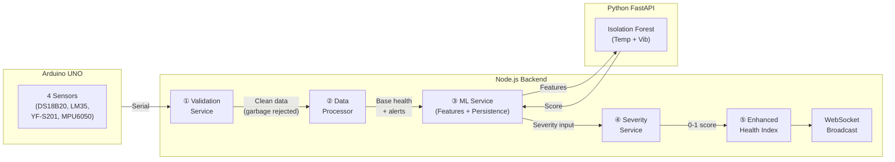

# Guardian Watch — System Enhancement Report

**Date**: 21 May 2026  
**Version**: v3.0 — Enhanced Predictive Intelligence  
**Scope**: 6 improvements to the ML inference pipeline (no hardware/model changes)

---

## Architecture Overview



**Pipeline flow (v3.0)**:
```
Serial Data
  → ① Validation (NaN, DS18B20 errors, spike suppression)
  → ② Data Processor (rule-based alerts + base health index)
  → ③ ML Service (features → Python model → improved persistence)
  → ④ Severity Service (unified multi-signal scoring)
  → ⑤ Enhanced Health Index (base + ML penalty)
  → WebSocket Broadcast + CSV Log
```

---

## 1. Data Validation Layer

**File**: [validation.service.ts](file:///d:/Sem-4/edi/guardian-watch/backend/src/services/validation.service.ts) (NEW)

**Why**: Raw sensor data can contain garbage (NaN from serial parsing errors, -127°C from DS18B20 initialization failures, single-reading spikes from electrical noise). Without validation, these propagate into the ML pipeline and cause false anomalies.

**Implementation**:

| Check | Description |
|-------|-------------|
| NaN/null detection | Rejects readings with missing or unparseable values |
| DS18B20 error codes | Rejects -127°C (disconnected) and 85°C (power-on default) |
| Range validation | Oil temp: -10–150°C, Vibration: 0–50 m/s², Flow: 0–15 L/min |
| Ambient fallback | Invalid ambient replaced with last-known-good value |
| **Spike suppression** | Confirm-or-discard pattern (see below) |

### Confirm-or-Discard Pattern

Single-reading spikes are handled with a hold-and-verify approach:

```
Reading N:   35°C  (normal)
Reading N+1: 95°C  (jump > 15°C → held as "tentative", not emitted)
Reading N+2: 36°C  (back to normal → tentative was a spike, DISCARD it)
```

If instead N+2 confirms the new level (e.g., 92°C), the change was real (sustained fault) and is passed through.

**Integration point**: Called FIRST in the orchestrator, before any processing.

---

## 2. Multi-Time-Scale Rate Analysis

**File**: [ml.service.ts](file:///d:/Sem-4/edi/guardian-watch/backend/src/services/ml.service.ts#L224-L238) (ENHANCED)

**Why**: Single-step rate-of-change (`current - previous`) only captures instantaneous change. It cannot distinguish between:
- A sensor drifting slowly over minutes (benign thermal cycling)
- An accelerating temperature rise (impending failure)

**Implementation**:

| Window | Size | Purpose |
|--------|------|---------|
| Short-term | Last 5 rates | Captures recent acceleration |
| Long-term | Last 20 rates | Captures baseline trend |

**Trend acceleration** = `mean(short_rates) - mean(long_rates)`

| Acceleration | Interpretation |
|--------------|----------------|
| ≈ 0 | Stable trend (normal operation or steady drift) |
| > 0 (positive) | Short-term rate exceeds long-term → accelerating toward failure |
| < 0 (negative) | Short-term rate below long-term → stabilizing/recovering |

**Industrial relevance**: This mimics how human operators spot danger — not by a single reading, but by noticing "it's heating up faster than before."

---

## 3. Unified Severity Scoring

**File**: [severity.service.ts](file:///d:/Sem-4/edi/guardian-watch/backend/src/services/severity.service.ts) (NEW)

**Why**: The system previously had three independent signals (ML anomaly score, threshold alerts, temporal persistence) that could contradict each other. A unified metric eliminates ambiguity.

**5-signal weighted combination**:

| Signal | Weight | Normalization |
|--------|--------|---------------|
| ML anomaly score | 0.40 | Decision function mapped to [0,1] |
| Persistence ratio | 0.25 | Fraction of recent anomalies |
| Rate of change | 0.15 | Absolute rate scaled by max expected |
| Rolling std dev | 0.10 | Window volatility indicator |
| Trend acceleration | 0.10 | Multi-time-scale acceleration |

**Output**: Single score 0–1 + level classification:

| Range | Level | Meaning |
|-------|-------|---------|
| 0.00 – 0.35 | NORMAL | All signals within expected bounds |
| 0.35 – 0.65 | WARNING | Sustained deviation detected |
| 0.65 – 1.00 | CRITICAL | Multiple signals confirming fault |

---

## 4. ML Score Integration into Health Index

**File**: [dataProcessor.ts](file:///d:/Sem-4/edi/guardian-watch/backend/src/services/dataProcessor.ts#L95-L113) (ENHANCED)

**Why**: The health index was purely rule-based (threshold penalties for temp/vib/flow). ML predictions were displayed separately but didn't influence the main score. This meant the health index couldn't provide early warning — it only reacted after thresholds were breached.

**Implementation**: New `enhanceHealthIndex()` method:

```
Enhanced Health = Base Health - ML Penalty

ML Penalty = round(tempSeverity.score × 10) + round(vibSeverity.score × 10)
           = up to 20 additional penalty points
```

**Effect**: The ML can now degrade the health index BEFORE rule-based thresholds are breached. For example:
- Oil temp at 40°C (below 42°C watch threshold) → base penalty = 0
- But ML detects an accelerating trend → severity = 0.5 → penalty = 5
- Health index drops from 100 to 95 → early warning signal

---

## 5. Improved Temporal Persistence

**File**: [ml.service.ts](file:///d:/Sem-4/edi/guardian-watch/backend/src/services/ml.service.ts#L240-L280) (ENHANCED)

**Why**: The old 3-of-5 sliding window had two problems:
1. A single recovery reading in the middle of a fault could briefly clear the warning
2. After a fault, the system snapped back to NORMAL too quickly

### Old vs New Comparison

| Behavior | Old (3-of-5) | New (Consecutive + Hold + Recovery) |
|----------|--------------|--------------------------------------|
| Trigger WARNING | 3 of last 5 anomalies | 3 consecutive anomalies |
| Clear WARNING | < 3 anomalies in window | Hold timer expired (8s) AND 5 consecutive normals |
| Single spike | Might contribute to 3-of-5 | Resets consecutive counter → no warning |
| Brief recovery during fault | Could clear warning | Hold timer prevents clearing |
| Sustained recovery | Instant clear | Requires 5 consecutive normal readings |

### State machine:

```
NORMAL ──[3 consecutive anomalies]──→ WARNING
                                         │
                                         │ hold timer: 8 seconds minimum
                                         │
WARNING ──[hold expired + 5 consecutive normals]──→ NORMAL
```

During WARNING, each new anomaly extends the hold timer by half (4s), making sustained faults very sticky.

---

## 6. Startup Stabilization

**File**: [ml.service.ts](file:///d:/Sem-4/edi/guardian-watch/backend/src/services/ml.service.ts#L282-L307) (ENHANCED)

**Why**: When sensors power on, DS18B20 may return default values, the MPU6050 needs calibration time, and flow sensors need the pump to stabilize. These transient readings would be flagged as anomalous by the ML model.

**Implementation**:

| Parameter | Value | Purpose |
|-----------|-------|---------|
| MIN_WARMUP | 10 readings | Absolute minimum before inference |
| MAX_WARMUP | 25 readings | Force start even if unstable |
| TEMP_STABILITY_STD | 5.0°C | Temp std must be below this |
| VIB_STABILITY_STD | 4.0 m/s² | Vib std must be below this |

**Logic**:
1. Collect first 10 readings → always output NORMAL
2. At reading 10+, check if rolling std < threshold
3. If stable → begin ML inference
4. If unstable → keep outputting NORMAL until stable or reading 25 (force start)

---

## Files Modified/Created

| File | Action | Purpose |
|------|--------|---------|
| `backend/src/services/validation.service.ts` | **NEW** | Data validation + spike suppression |
| `backend/src/services/severity.service.ts` | **NEW** | Unified 5-signal severity scoring |
| `backend/src/services/ml.service.ts` | **REWRITE** | Multi-time-scale, persistence, startup |
| `backend/src/services/dataProcessor.ts` | **ENHANCED** | ML-enhanced health index |
| `backend/src/index.ts` | **ENHANCED** | Updated orchestrator pipeline |

## Files Unchanged

| File | Reason |
|------|--------|
| `python/app.py` | Stateless model server — no changes needed |
| `models/*.pkl` | Trained models — not retrained |
| `arduino/*.ino` | Hardware sketch — not modified |
| `src/**` (frontend) | Dashboard — no changes needed (data flows through existing interfaces) |

---

## False-Positive Reduction Summary

| Mechanism | Targets |
|-----------|---------|
| Validation layer | Sensor errors, NaN, garbage serial data |
| Confirm-or-discard | Single-reading electrical spikes |
| Startup stabilization | Power-on transients, sensor warm-up |
| Consecutive anomaly counting | Random isolated ML false positives |
| Warning hold timer | Prevents oscillation during intermittent faults |
| Recovery gate (5 normals) | Prevents premature clearing during unstable recovery |
| Unified severity weighting | Reduces impact of any single noisy signal |

---

## Industrial Relevance

This system now mirrors real SCADA/DCS monitoring systems used in substations:

1. **Input validation** — equivalent to signal conditioning in PLCs
2. **Multi-time-scale analysis** — used in vibration monitoring (ISO 10816)
3. **Persistence filtering** — standard in alarm management (ISA-18.2)
4. **Unified severity** — maps to IEC 60599 dissolved gas severity scoring
5. **ML-enhanced health** — similar to transformer health index standards (IEEE C57.104)
6. **Startup suppression** — standard practice in process control (NAMUR NE107)
