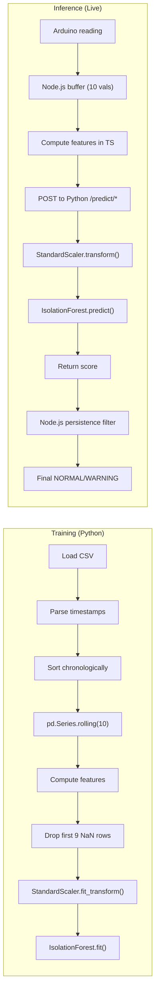
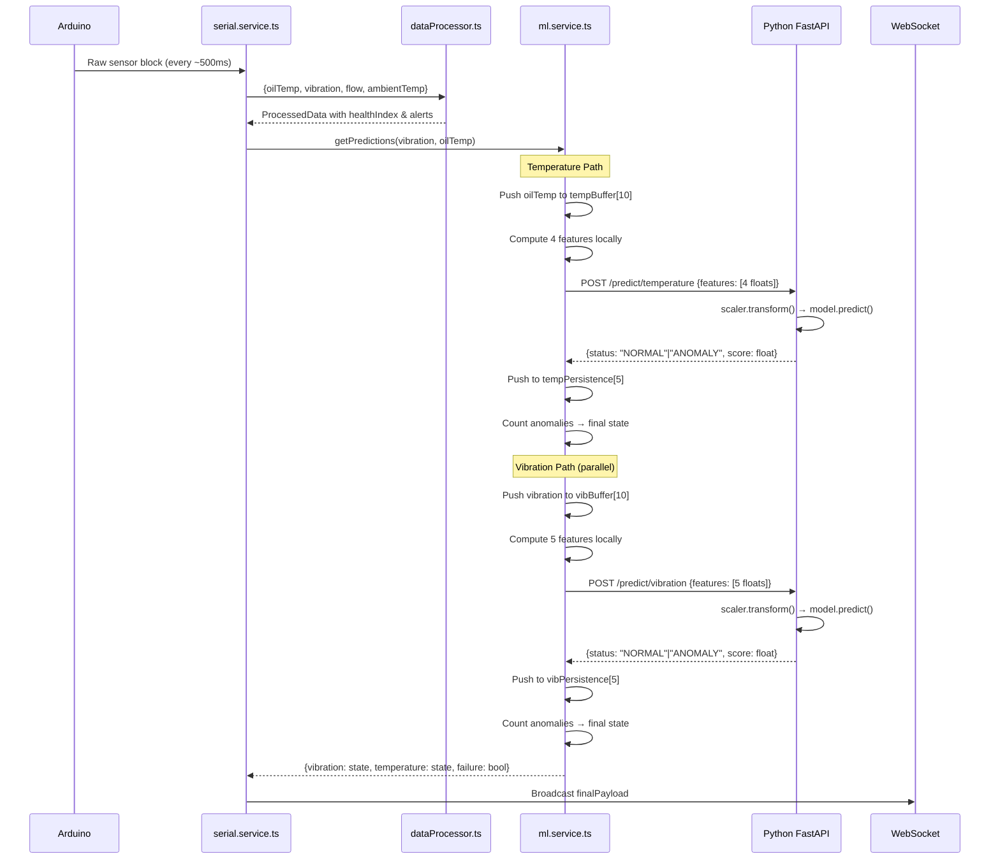

# Transense — ML Rewrite Implementation Plan

## Goal
Replace the existing multi-model ML system (Isolation Forest + LSTM Autoencoder) with two clean, separate Isolation Forest models focused on **temporal trend detection** rather than instant threshold detection. Output states: `NORMAL` or `WARNING` only.

---

## User Review Required

> [!IMPORTANT]
> **Breaking change to ML output states.** The current system outputs `NORMAL | WARNING | FAILURE`. The new system will output `NORMAL | WARNING` only. The `FAILURE` state is removed. The `failure` flag in `MlPredictionResult` will be redefined as `true` when **both** models output `WARNING` simultaneously.

> [!IMPORTANT]
> **TensorFlow dependency removed.** The vibration model moves from LSTM Autoencoder (`.h5`) to Isolation Forest (`.pkl`). The `tensorflow` import in `app.py` will be removed entirely, drastically reducing startup time and memory footprint.

> [!WARNING]
> **Window size change.** The current vibration model uses a 50-sample buffer. The new system will use a **10-sample rolling window** for both models. This means faster warm-up (10 readings vs 50) but different temporal sensitivity.

## Open Questions

> [!IMPORTANT]
> **Persistence window size**: I plan to use 5 consecutive anomaly readings as the threshold for triggering `WARNING`. Should this be configurable, or is 5 readings (~5 seconds at 1Hz) acceptable?

> [!IMPORTANT]  
> **Startup behavior**: During the first 10 readings (while the rolling window fills), the system returns `NORMAL` unconditionally. Is this acceptable, or should it display a `WARMING_UP` state on the dashboard?

---

## 1. Data Inventory & CSV Parsing Strategy

### 1.1 File Assignment (Strict)

| Role | Files | Combined Rows |
|------|-------|---------------|
| **Training** | `data.csv`, `synthetic_data_1.csv`, `synthetic_data_2.csv`, `synthetic_data_3.csv` | ~1,111 |
| **Testing** | `synthetic_data_4.csv`, `synthetic_data_5.csv` | ~500 |

### 1.2 Data Profiles (from analysis)

| File | Rows | Temp Range (°C) | Vib Range (m/s²) | Behavior |
|------|------|-----------------|-------------------|----------|
| `data.csv` | 251 | 0.0–31.7 | 0.38–10.0 | Real hardware, stable normal |
| `synthetic_data_1.csv` | 280 | 9.3–32.5 | 0.47–12.3 | Normal warm + stable long run |
| `synthetic_data_2.csv` | 300 | 8.8–39.9 | 0.97–13.1 | Normal cool → **temperature fault** |
| `synthetic_data_3.csv` | 280 | 9.2–30.7 | 0.73–13.9 | Stable → **vibration fault** |
| `synthetic_data_4.csv` | 250 | 9.4–51.3 | 0.76–16.3 | **Test**: combined fault |
| `synthetic_data_5.csv` | 250 | 9.2–31.7 | 0.13–10.7 | **Test**: gradual degradation |

### 1.3 Critical CSV Parsing Issue

> [!CAUTION]
> **The timestamp column contains a comma** (e.g., `15-05-2026, 10:52:46 am`). Since it is NOT quoted, `pandas.read_csv()` will misparse all columns. The synthetic files also contain `\r\r\n` double line endings (blank rows).

**Parsing strategy:**
```
1. Read file with: pd.read_csv(file, header=None, skiprows=1, skip_blank_lines=True)
2. This produces 11 columns (0–10) instead of the expected 10
3. Reconstruct timestamp:  col[0] + "," + col[1]  →  "DD-MM-YYYY, HH:MM:SS am/pm"
4. Map remaining columns:  col[2]=Mode, col[3]=Oil_Temp_C, col[4]=Vibration_g, ...
5. Parse timestamp with:   pd.to_datetime(ts, format="%d-%m-%Y, %I:%M:%S %p")
6. Discard all columns except Timestamp + the target column (Oil_Temp_C or Vibration_g)
```

### 1.4 Column Isolation (Strict — No Data Leakage)

| Model | Columns Used | All Others |
|-------|-------------|------------|
| Temperature | `Timestamp`, `Oil_Temp_C` | **Ignored** |
| Vibration | `Timestamp`, `Vibration_g` | **Ignored** |

---

## 2. Feature Engineering Pipeline

### 2.1 Common Parameters

| Parameter | Value | Rationale |
|-----------|-------|-----------|
| Sampling rate | ~1 Hz (1 reading/second) | Matches Arduino serial output rate |
| Rolling window | **10 readings** | 10-second trend context; enough to smooth noise, small enough for responsive detection |
| Min valid rows | 10 | First 10 rows of each session produce NaN → dropped |

### 2.2 Temperature Features (4 features)

Computed for every row `i` using the 10-row rolling window ending at row `i`:

| # | Feature | Formula | Physical Meaning |
|---|---------|---------|------------------|
| 1 | `oil_temp` | `Oil_Temp_C[i]` | Current instantaneous reading |
| 2 | `temp_rate_of_change` | `(Oil_Temp_C[i] - Oil_Temp_C[i-1]) / Δt_seconds` | How fast temperature is changing (°C/sec) |
| 3 | `temp_rolling_mean` | `mean(Oil_Temp_C[i-9 : i+1])` | Smoothed temperature over 10s window |
| 4 | `temp_rolling_std` | `std(Oil_Temp_C[i-9 : i+1])` | Temperature volatility over 10s window |

**Rate of change calculation detail:**
- During training: `Δt` is computed from the parsed timestamp differences between consecutive rows
- During live inference: `Δt` is the elapsed time between Node.js readings (~1 second)
- Floor `Δt` at 0.1 seconds to prevent division-by-zero from timestamp jitter

### 2.3 Vibration Features (5 features)

| # | Feature | Formula | Physical Meaning |
|---|---------|---------|------------------|
| 1 | `vibration` | `Vibration_g[i]` | Current instantaneous reading |
| 2 | `vib_rate_of_change` | `(Vibration_g[i] - Vibration_g[i-1]) / Δt_seconds` | How fast vibration is changing |
| 3 | `vib_rolling_mean` | `mean(Vibration_g[i-9 : i+1])` | Smoothed vibration over 10s window |
| 4 | `vib_rms` | `sqrt(mean(Vibration_g[i-9 : i+1]²))` | Root-mean-square — captures energy magnitude |
| 5 | `vib_rolling_std` | `std(Vibration_g[i-9 : i+1])` | Vibration volatility (mechanical instability signal) |

### 2.4 Feature Engineering in Training vs Inference

The **exact same formulas** must be used in both places. Here is how each context computes them:



---

## 3. Model Training Strategy

### 3.1 Architecture: Isolation Forest × 2

| Setting | Temperature Model | Vibration Model |
|---------|-------------------|-----------------|
| Algorithm | `IsolationForest` | `IsolationForest` |
| `n_estimators` | 150 | 150 |
| `contamination` | 0.08 | 0.10 |
| `random_state` | 42 | 42 |
| `max_features` | 1.0 (all) | 1.0 (all) |
| Scaler | `StandardScaler` | `StandardScaler` |
| Input features | 4 | 5 |

**Contamination rationale:**
- Temperature: ~8% of training data contains fault behavior (synthetic_data_2 anomaly segment: ~90 rows / 1111 total)
- Vibration: ~10% of training data contains fault behavior (synthetic_data_3 anomaly segment: ~100 rows / 1111 total)

### 3.2 Training Data Pipeline

```
For each model:
1. Load all 4 training CSV files → parse with custom loader
2. Extract ONLY the target column + Timestamp
3. Sort each file's data by timestamp
4. Compute features per-file (to avoid cross-session rolling window contamination)
5. Drop NaN rows (first 9 of each file)
6. Concatenate all feature DataFrames
7. Fit StandardScaler on combined training features
8. Transform training features
9. Fit IsolationForest on scaled training features
10. Save:  model.pkl + scaler.pkl  →  models/<type>/
```

> [!IMPORTANT]
> **Per-file feature computation (Step 4)** is critical. Rolling windows must NOT span across file boundaries. Each CSV represents a separate motor session. If we compute features across the concatenated data, the rolling window at file boundaries would mix the tail of one session with the start of another, creating artificial anomalies.

### 3.3 Output Artifacts

| File | Path | Contents |
|------|------|----------|
| Temperature model | `models/temperature/isolation_forest_model.pkl` | Trained IsolationForest |
| Temperature scaler | `models/temperature/scaler.pkl` | Fitted StandardScaler |
| Vibration model | `models/vibration/isolation_forest_model.pkl` | Trained IsolationForest |
| Vibration scaler | `models/vibration/scaler.pkl` | Fitted StandardScaler |

These paths match the existing `app.py` model loading paths. The old `vibration_model.h5`, `vibration_threshold.pkl`, and `vibration/scaler.pkl` will be replaced.

### 3.4 Evaluation on Test Set

After training, evaluate on `synthetic_data_4.csv` and `synthetic_data_5.csv` using:
1. Same feature engineering pipeline
2. Same scaler (`.transform()` only, NOT `.fit_transform()`)
3. Compute `predict()` and `decision_function()` for each row
4. Generate classification report: precision, recall per state
5. Plot decision scores over time to visually validate that sustained anomalies produce clustered low scores while spikes do not

---

## 4. Temporal Persistence Filtering

### 4.1 The Problem

Isolation Forest operates on individual feature vectors. A single noisy reading or startup transient can produce a one-off anomaly score. Industrial monitoring requires **sustained trend detection**, not spike detection.

### 4.2 Solution: Sliding Anomaly Counter (in Node.js)

The persistence filter runs **after** receiving the raw model prediction from Python, **inside** the Node.js `ml.service.ts`:

```
STATE MACHINE (per model):
┌─────────────────────────────────────────────────────────────┐
│                                                             │
│   persistenceBuffer = circular array of last 5 predictions  │
│   (each is: true=anomaly, false=normal)                     │
│                                                             │
│   On each new prediction:                                   │
│     1. Push raw_anomaly_flag to persistenceBuffer            │
│     2. Count anomalies in buffer                            │
│     3. If anomaly_count >= 3 out of 5  →  output "WARNING"  │
│     4. Else  →  output "NORMAL"                             │
│                                                             │
└─────────────────────────────────────────────────────────────┘
```

### 4.3 Why 3-of-5?

| Scenario | Raw Predictions | Count | Output | Correct? |
|----------|----------------|-------|--------|----------|
| Single spike | `[N, N, A, N, N]` | 1/5 | NORMAL | ✅ Spike filtered |
| Two spikes | `[N, A, N, A, N]` | 2/5 | NORMAL | ✅ Noise filtered |
| Sustained fault | `[A, A, A, A, N]` | 4/5 | WARNING | ✅ Trend detected |
| Emerging fault | `[N, N, A, A, A]` | 3/5 | WARNING | ✅ Trend detected |
| Startup noise | `[A, A, N, N, N]` | 2/5 | NORMAL | ✅ Startup filtered |

### 4.4 Implementation Location

The persistence filter is placed in **Node.js** (not Python) because:
1. Python service stays **stateless** — each request is independent, making it testable and debuggable
2. Node.js already maintains state (buffers, connection status)
3. Persistence is an application-level policy, not a model concern

---

## 5. System Integration — Full Data Flow

### 5.1 End-to-End Live Inference Pipeline



### 5.2 Files to Modify

---

### Python ML Service

#### [MODIFY] [app.py](file:///d:/Sem-4/edi/guardian-watch/python/app.py)

**Changes:**
- Remove `tensorflow` import entirely
- Remove `build_vib_model()` function
- Remove all H5/LSTM loading logic
- Add vibration Isolation Forest loading (`models/vibration/isolation_forest_model.pkl`)
- Change `VibRequest` to accept `features: List[float]` (5 floats) instead of `samples: List[float]` (50 raw values)
- Unify prediction logic: both endpoints use `scaler.transform()` → `model.predict()` → `decision_function()`
- **Remove `FAILURE` state**. Output only `NORMAL` or `ANOMALY` (Python returns raw model result; Node.js converts to `WARNING` after persistence filter)
- Return `{status: "NORMAL"|"ANOMALY", score: float}` for both endpoints

**Why `ANOMALY` instead of `WARNING`?**
Python returns the raw model output. The Node.js persistence filter is what decides if an anomaly is sustained enough to be a `WARNING`. This separation keeps the Python service stateless and honest about what the model sees.

---

### Node.js Backend

#### [MODIFY] [ml.service.ts](file:///d:/Sem-4/edi/guardian-watch/backend/src/services/ml.service.ts)

**Changes:**
- Change `TEMP_WINDOW` from 5 → 10
- Change `VIB_WINDOW` from 50 → 10
- Remove `lastRateOfChange` and `acceleration` calculation (we drop acceleration feature)
- Add `vibBuffer: number[]` as a 10-element sliding window
- Compute vibration features locally: `[vibration, rate_of_change, rolling_mean, rms, rolling_std]`
- Temperature features: `[oil_temp, rate_of_change, rolling_mean, rolling_std]`
- Add persistence buffer arrays: `tempPersistence: boolean[]` and `vibPersistence: boolean[]` (length 5)
- Map Python response: `"ANOMALY"` → push `true` to persistence buffer
- Final output: count anomalies in persistence buffer ≥ 3 → `"WARNING"`, else `"NORMAL"`
- Update `MlPredictionState` type to remove `"FAILURE"` (keep `"WARNING"`)
- Update failure logic: `failure = (vibState === "WARNING" && tempState === "WARNING")`

#### [MODIFY] [thresholds.ts](file:///d:/Sem-4/edi/guardian-watch/backend/src/config/thresholds.ts)

**No changes required.** Rule-based thresholds remain independent of ML predictions.

#### No changes to:
- `serial.service.ts` — serial parsing is unaffected
- `dataProcessor.ts` — rule-based health index is unaffected
- `index.ts` — orchestrator flow stays the same
- `socket.ts` — WebSocket broadcast is unaffected
- `api.ts` — REST routes are unaffected

---

### Training Scripts

#### [NEW] [train_temperature.py](file:///d:/Sem-4/edi/guardian-watch/models/temperature/train_temperature.py)

Self-contained training script that:
1. Loads 4 training CSVs with custom parser
2. Extracts `Timestamp` + `Oil_Temp_C` only
3. Computes 4 features per-file (no cross-session window leakage)
4. Fits `StandardScaler` + `IsolationForest`
5. Evaluates on 2 test CSVs
6. Saves `isolation_forest_model.pkl` + `scaler.pkl`
7. Prints evaluation metrics and plots decision scores

#### [NEW] [train_vibration.py](file:///d:/Sem-4/edi/guardian-watch/models/vibration/train_vibration.py)

Same structure but with 5 vibration features.

---

### Frontend

#### No changes required to:
- `src/routes/index.tsx` — dashboard reads `mlPrediction.vibration` and `mlPrediction.temperature` which will still be `MlState` strings
- `src/components/MLPanel.tsx` — already handles `NORMAL` and `WARNING` states
- `src/lib/socket.ts` — type `MlState` already includes `"WARNING"`

> [!NOTE]
> The `FAILURE` state will no longer be emitted by ML predictions. The frontend's `MLPanel` component already handles `NORMAL` and `WARNING` with appropriate styling. The `failure` boolean flag continues to function as-is.

---

## 6. Feature Engineering Match Verification

This is the most critical alignment check. The exact same features computed during training must be reproduced during live inference.

### 6.1 Temperature Feature Match

| Feature | Training (Python) | Inference (Node.js → Python) |
|---------|-------------------|------------------------------|
| `oil_temp` | `df['Oil_Temp_C'].iloc[i]` | `value` parameter passed to `getTemperaturePrediction()` |
| `rate_of_change` | `df['Oil_Temp_C'].diff() / df['Timestamp'].diff().dt.total_seconds()` | `(value - lastOilTemp) / elapsedSeconds` |
| `rolling_mean` | `df['Oil_Temp_C'].rolling(10).mean()` | `sum(tempBuffer) / tempBuffer.length` |
| `rolling_std` | `df['Oil_Temp_C'].rolling(10).std()` | `sqrt(sum((x - mean)²) / (N-1))` ← **use sample std (N-1)** to match pandas default |

> [!WARNING]
> **Std deviation mismatch risk**: `pandas.rolling().std()` uses **sample** std (ddof=1, divides by N-1). The current Node.js code uses **population** std (divides by N). This must be fixed in the Node.js code to use `N-1` denominator to match the training scaler exactly.

### 6.2 Vibration Feature Match

| Feature | Training (Python) | Inference (Node.js → Python) |
|---------|-------------------|------------------------------|
| `vibration` | `df['Vibration_g'].iloc[i]` | `value` parameter |
| `rate_of_change` | `df['Vibration_g'].diff() / df['Timestamp'].diff().dt.total_seconds()` | `(value - lastVibration) / elapsedSeconds` |
| `rolling_mean` | `df['Vibration_g'].rolling(10).mean()` | `sum(vibBuffer) / vibBuffer.length` |
| `rms` | `sqrt(mean(df['Vibration_g'].rolling(10).apply(lambda x: x**2)))` | `sqrt(sum(x² for x in vibBuffer) / vibBuffer.length)` |
| `rolling_std` | `df['Vibration_g'].rolling(10).std()` | `sqrt(sum((x - mean)²) / (N-1))` |

### 6.3 Live Input vs CSV Format

| Source | Oil Temp arrives as | Vibration arrives as |
|--------|--------------------|--------------------|
| Arduino Serial | `float` from `Oil Temp: 31.4 C` | `float` from `Vibe RMS: 5.213 m/s^2` |
| Node.js `serialData` | `serialData.oilTemp` (float) | `serialData.vibration` (float) |
| CSV column | `Oil_Temp_C` (float) | `Vibration_g` (float) |

**Unit match confirmed**: Both sources produce raw float values in the same units. No conversion needed.

---

## 7. Training Script Structure

```
models/
├── temperature/
│   ├── train_temperature.py      ← [NEW] Training script
│   ├── isolation_forest_model.pkl ← [OUTPUT] Overwrites existing
│   ├── scaler.pkl                 ← [OUTPUT] Overwrites existing
│   └── train.py                   ← [KEEP] Old training code (reference)
│
└── vibration/
    ├── train_vibration.py         ← [NEW] Training script
    ├── isolation_forest_model.pkl ← [OUTPUT] New file
    ├── scaler.pkl                 ← [OUTPUT] Overwrites existing
    ├── vibration_model.h5         ← [DELETE] No longer used
    ├── vibration_threshold.pkl    ← [DELETE] No longer used
    └── train.txt                  ← [KEEP] Old training code (reference)
```

### 7.1 Shared Utility Module

Both training scripts will share a common CSV loading function. To keep them self-contained (no import dependencies between model folders), each script will include the parser inline or a shared utility file will be placed at `models/utils.py`.

**Decision**: Place a `utils.py` at `models/utils.py` with:
- `load_transense_csv(filepath, target_column)` → returns DataFrame with `[Timestamp, target_column]`
- `compute_temp_features(df, window=10)` → returns feature DataFrame
- `compute_vib_features(df, window=10)` → returns feature DataFrame

---

## 8. Verification Plan

### 8.1 Automated Tests

1. **Training validation**: Run both `train_temperature.py` and `train_vibration.py`. Verify:
   - Models produce `.pkl` files at the correct paths
   - No errors during feature engineering or fitting
   - Print classification accuracy on test set

2. **Offline evaluation**: On test files (`synthetic_data_4.csv`, `synthetic_data_5.csv`):
   - Plot `decision_function()` scores over time
   - Verify that sustained fault segments produce clustered negative scores
   - Verify that startup/spike noise does NOT produce sustained negative scores
   - Print confusion matrix against ground-truth fault segments

3. **Integration smoke test**:
   ```bash
   # Terminal 1: Start Python ML service
   python python/app.py
   
   # Terminal 2: Start Node.js backend
   npm --prefix backend run dev
   
   # Terminal 3: Verify health endpoint
   curl http://127.0.0.1:8000/health
   # Expected: {"status":"online","models":{"temperature":"LOADED","vibration":"LOADED"}}
   ```

4. **Live prediction test**: Start the full system with `npm run dev`, observe the dashboard. During stable operation: both models should show `NORMAL`. During simulated anomaly cycles (simulator mode triggers anomalies every 30-40 cycles): vibration model should show `WARNING` after persistence filter kicks in.

### 8.2 Manual Verification

- Run the full stack and observe the dashboard for 2+ minutes
- Verify the persistence filter correctly suppresses startup noise
- Verify that sustained simulator anomaly cycles trigger `WARNING`
- Verify that single-row noise spikes do NOT trigger `WARNING`
- Check the CSV logger output to confirm the new ML status values are logged correctly

---

## 9. Summary of All Changes

| File | Action | Scope |
|------|--------|-------|
| `models/utils.py` | **NEW** | Shared CSV loader + feature engineering |
| `models/temperature/train_temperature.py` | **NEW** | Temperature model training |
| `models/vibration/train_vibration.py` | **NEW** | Vibration model training |
| `python/app.py` | **MODIFY** | Remove TF, unify to dual Isolation Forest |
| `backend/src/services/ml.service.ts` | **MODIFY** | New feature computation + persistence filter |
| `models/temperature/isolation_forest_model.pkl` | **OVERWRITE** | Retrained model |
| `models/temperature/scaler.pkl` | **OVERWRITE** | Refitted scaler |
| `models/vibration/isolation_forest_model.pkl` | **NEW** | New Isolation Forest model |
| `models/vibration/scaler.pkl` | **OVERWRITE** | Refitted scaler |
| `models/vibration/vibration_model.h5` | **DELETE** | LSTM no longer used |
| `models/vibration/vibration_threshold.pkl` | **DELETE** | Threshold no longer used |
| `python/requirements.txt` | **MODIFY** | Remove `tensorflow` |

**Files NOT modified**: `serial.service.ts`, `dataProcessor.ts`, `index.ts`, `socket.ts`, `api.ts`, `thresholds.ts`, all frontend components.
